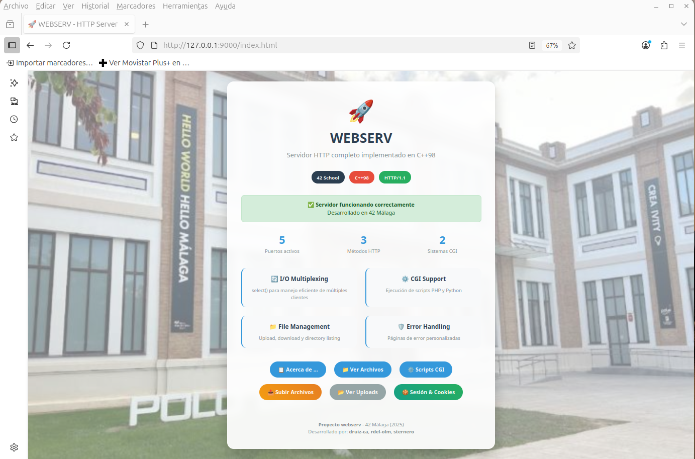
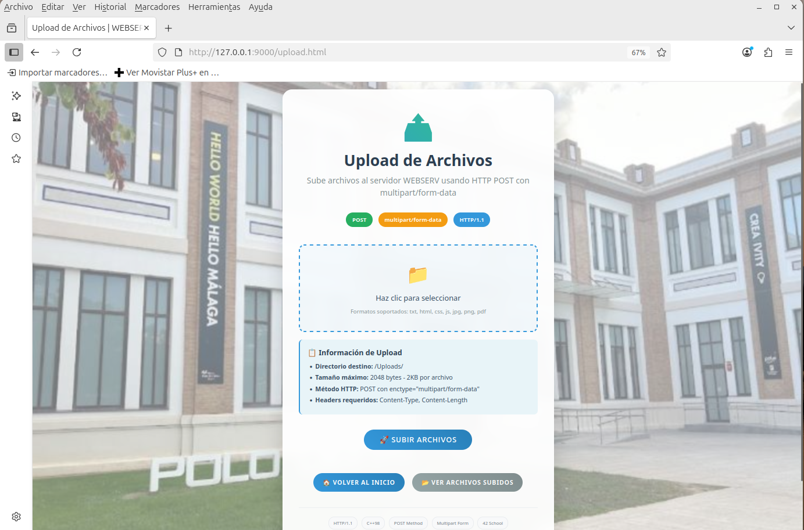
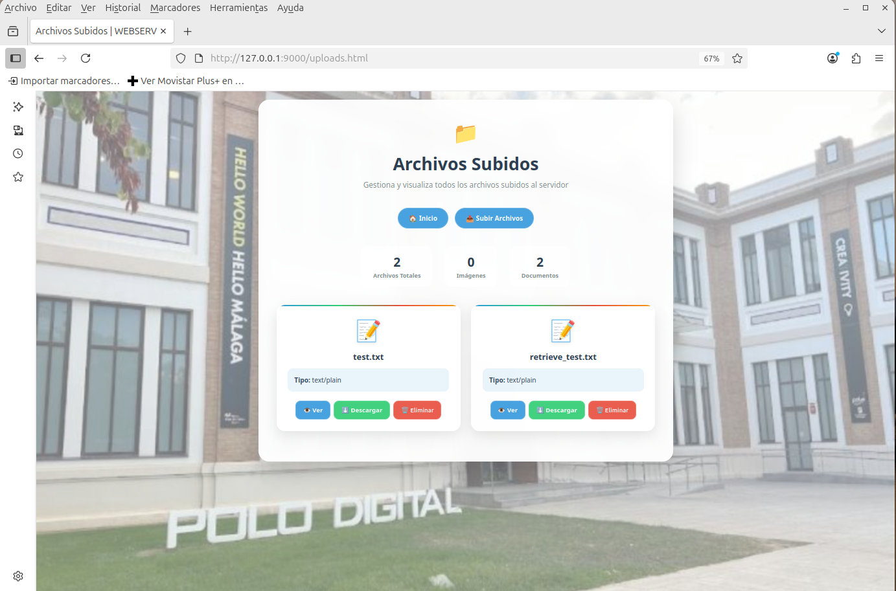
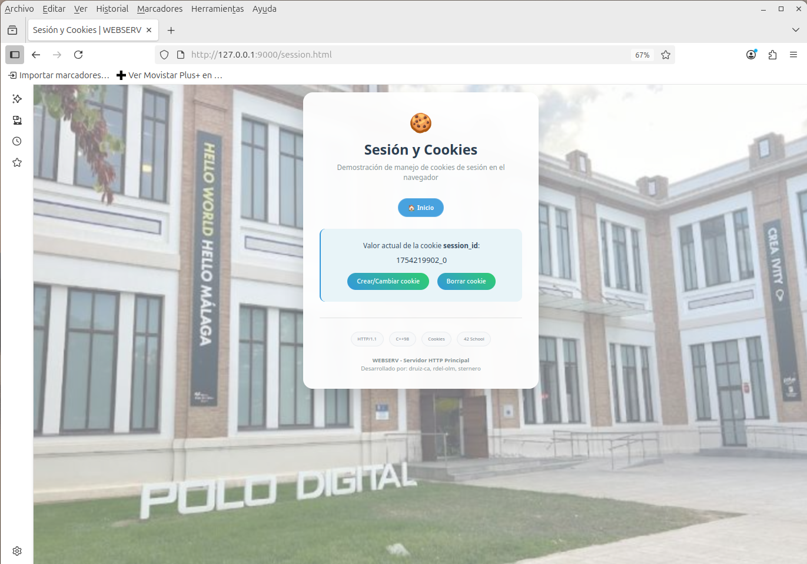
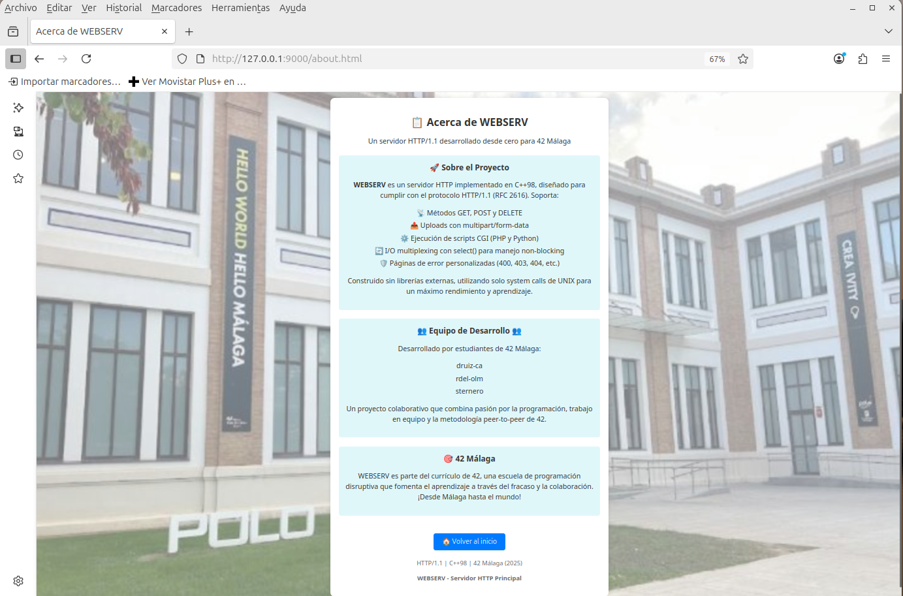
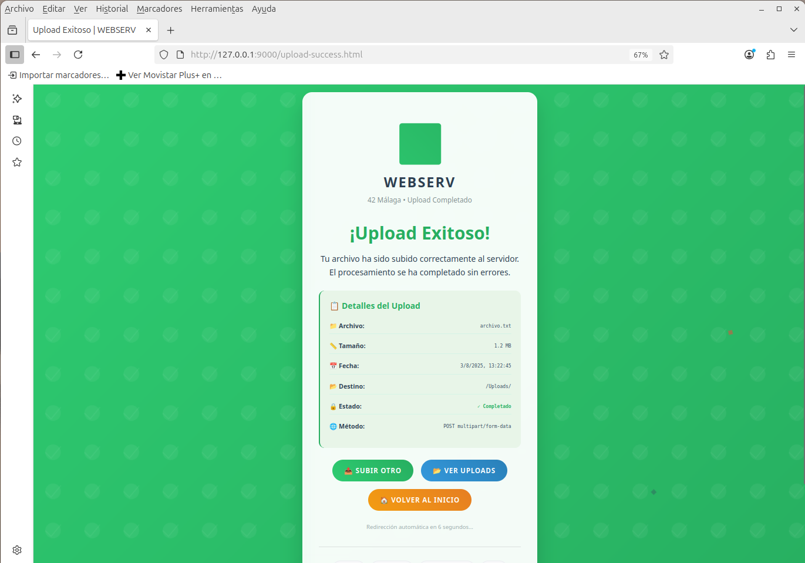
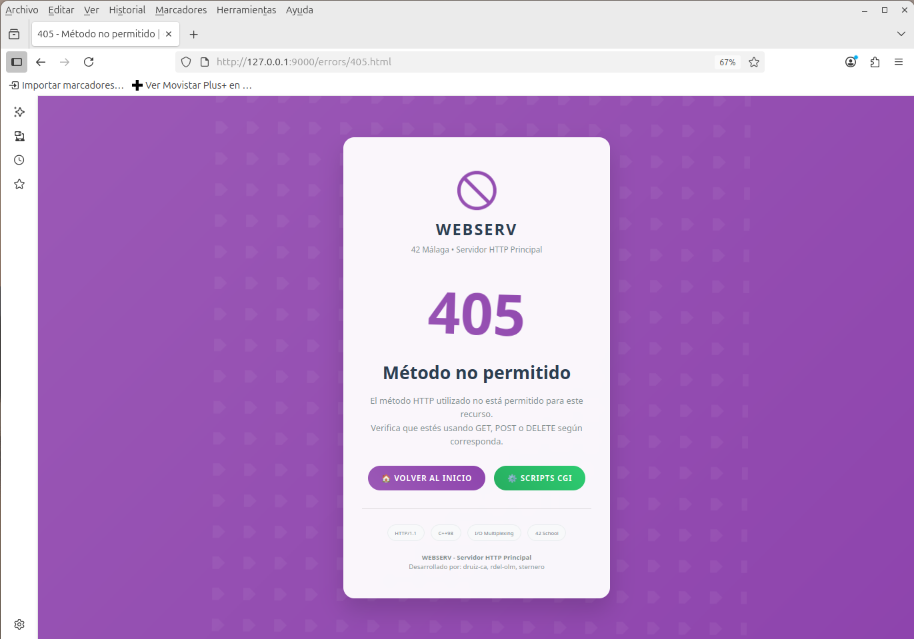
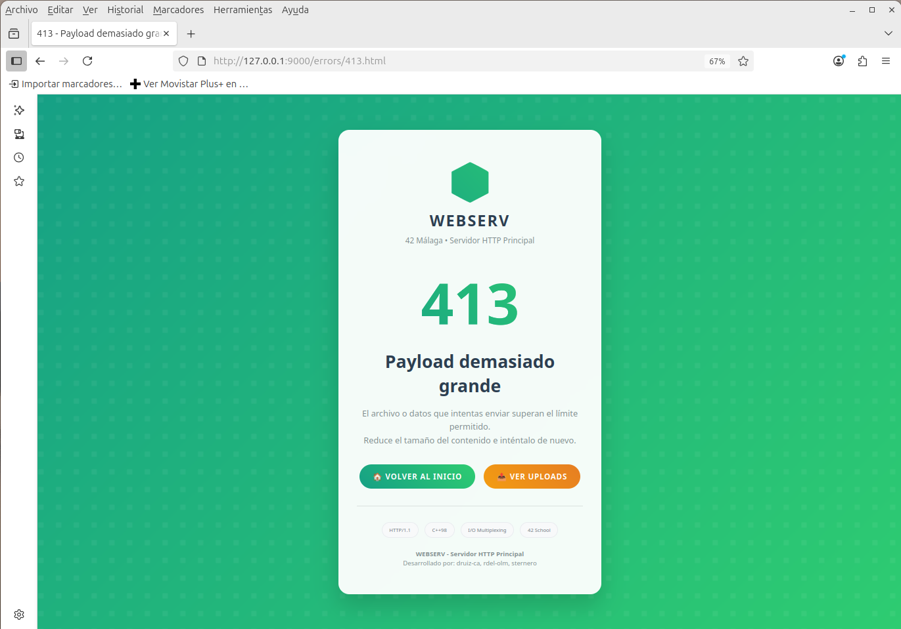

# 🚀 WEBSERV - HTTP Server Implementation

[](https://42.fr)
[](https://en.wikipedia.org/wiki/C%2B%2B98)
[](https://tools.ietf.org/html/rfc2616)

Un servidor HTTP completo implementado en C++98 que cumple con los estándares HTTP/1.1, desarrollado como parte del curriculum de 42 School en el campus de 42 Málaga.

## 📋 Tabla de Contenidos

- [🎯 Características Principales](#-características-principales)
- [🔧 Instalación y Compilación](#-instalación-y-compilación)
- [🚀 Uso](#-uso)
- [📁 Estructura del Proyecto](#-estructura-del-proyecto)
- [⚙️ Configuración](#️-configuración)
- [🧪 Testing y Evaluación](#-testing-y-evaluación)
- [📖 Documentación Técnica](#-documentación-técnica)
- [👥 Autores](#-autores)

## 🎯 Características Principales

### ✅ **Core Features (Mandatory)**
- **HTTP/1.1 Compliance** - Implementación completa del protocolo HTTP/1.1
- **select() I/O Multiplexing** - Manejo de múltiples clientes simultáneos sin threads
- **Non-blocking Operations** - Operaciones de red no bloqueantes para máximo rendimiento
- **Multi-Server Support** - Soporte para múltiples servidores virtuales
- **Multi-Port Support** - Capacidad de escuchar en múltiples puertos
- **HTTP Methods**: GET, POST, DELETE
- **Status Codes**: 200, 201, 301, 307, 400, 403, 404, 405, 413, 500
- **File Upload/Download** - Subida y descarga de archivos
- **Directory Listing** - Listado de directorios cuando está habilitado
- **Error Pages** - Páginas de error personalizables
- **CGI Support** - Ejecución de scripts PHP y Python
- **Configuration File** - Sistema de configuración flexible similar a nginx

### 🌟 **Bonus Features**
- **Session Management** - Gestión de sesiones con cookies
- **Visit Counter** - Contador de visitas por sesión
- **Multiple CGI Systems** - Soporte para PHP y Python simultáneamente

## 🔧 Instalación y Compilación

### Prerrequisitos
- Sistema operativo: Linux/macOS
- Compilador: g++ con soporte C++98
- Herramientas opcionales: `siege`, `curl` para testing

### Compilación
```bash
git clone <repository-url>
cd webserv
make
```

### Comandos Adicionales
```bash
make clean    # Limpiar archivos objeto
make fclean   # Limpiar todo
make re       # Recompilar completamente
```

## 🚀 Uso

```bash
# Ejecutar con configuración por defecto
./webserv

# Ejecutar con archivo específico
./webserv config/default.conf
```

### Ejemplo Rápido
```bash
# 1. Compilar y ejecutar
make && ./webserv config/default.conf

# 2. Probar en otra terminal
curl http://localhost:8080/
curl -X POST -d "test" http://localhost:8080/upload/
curl http://localhost:8080/cgi-bin/test.php
```

## 📁 Estructura del Proyecto

```
webserv/
├── 📄 Makefile                    # Sistema de compilación
├── 📄 README.md                   # Este archivo
├── 📁 config/                     # Archivos de configuración
│   └── default.conf               # Configuración por defecto
├── 📁 include/                    # Headers del proyecto
│   ├── CGI.hpp                    # Manejo de CGI
│   ├── Client.hpp                 # Estructura de cliente
│   ├── Config.hpp                 # Parser de configuración
│   ├── Request.hpp                # Parser de requests HTTP
│   ├── Response.hpp               # Generador de responses HTTP
│   └── Server.hpp                 # Core del servidor
├── 📁 srcs/                       # Código fuente
│   ├── CGI.cpp                    # Implementación CGI
│   ├── Config.cpp                 # Parser de configuración
│   ├── main.cpp                   # Punto de entrada
│   ├── Request.cpp                # Parser HTTP requests
│   ├── Response.cpp               # Generador HTTP responses
│   └── Server.cpp                 # Core del servidor con select()
├── 📁 www/                        # Directorio web por defecto
│   ├── index.html                 # Página principal
│   ├── 📁 cgi-bin/               # Scripts CGI
│   ├── 📁 errors/                # Páginas de error
│   ├── 📁 files/                 # Archivos servidos
│   └── 📁 Uploads/               # Directorio de uploads
├── 📁 www2/                       # Segundo sitio virtual
├── 📁 evaluation_test/            # Suite de evaluación automatizada
├── 📁 evaluation_ask/             # Documentación de evaluación
├── 🔧 evaluation.sh               # Script de evaluación principal
├── 🔧 stress_tests.sh             # Tests de estrés
└── 🔧 siege_test.sh               # Tests con Siege
```

## ⚙️ Configuración

### Archivo de Configuración
El servidor utiliza un sistema de configuración similar a nginx:

```nginx
server {
    listen 8080;
    server_name localhost;
    root ./www;
    index index.html;
    client_max_body_size 10M;
    
    error_page 404 /errors/404.html;
    error_page 500 /errors/500.html;
    
    location / {
        methods GET POST DELETE;
        directory_listing on;
    }
    
    location /cgi-bin/ {
        methods GET POST;
        cgi_path .php /usr/bin/php;
        cgi_path .py /usr/bin/python3;
    }
    
    location /upload/ {
        methods POST;
        upload_path ./Uploads/;
    }
}
```

**📖 Para configuración avanzada y ejemplos detallados, consulta `config/default.conf`**

## 🧪 Testing y Evaluación

### Quick Testing
```bash
# Evaluación completa automática
./evaluation.sh

# Suite de evaluación detallada
cd evaluation_test/ && ./run_all_evaluations.sh

# Tests de estrés y rendimiento
./stress_tests.sh
./siege_test.sh
```

### Ejemplos de Uso
```bash
# Iniciar servidor
./webserv config/default.conf

# Tests básicos
curl http://localhost:8080/
curl -X POST -d "test" http://localhost:8080/upload/
curl -X DELETE http://localhost:8080/files/test.txt
curl http://localhost:8080/cgi-bin/test.php
```

**📋 Para testing detallado y verificación de puntos críticos, consulta `evaluation_test/README.md`**

## 📖 Documentación Técnica

### Arquitectura del Sistema
- **Server.cpp**: Core con select() I/O multiplexing
- **Request.cpp**: Parser HTTP/1.1 con soporte chunked encoding
- **Response.cpp**: Generador de responses con session management
- **Config.cpp**: Parser de configuración con validación
- **CGI.cpp**: Executor de scripts con timeout y environment setup

### Cumplimiento de Estándares
- ✅ **HTTP/1.1 RFC 2616** - Headers, status codes, methods
- ✅ **C++98 Standard** - Sin características modernas de C++
- ✅ **POSIX Compliance** - select(), sockets, file operations
- ✅ **42 School Standards** - Norminette, sin external libraries

### Características Técnicas Avanzadas
- **Non-blocking I/O**: Todas las operaciones de red son no bloqueantes
- **Session Management**: Sistema de cookies para funcionalidad bonus
- **Chunked Encoding**: Soporte completo para Transfer-Encoding: chunked
- **Multipart Parsing**: Manejo de uploads multipart/form-data
- **Error Recovery**: Manejo robusto de errores sin crashes
- **Memory Management**: Sin memory leaks, cleanup automático

## 🎯 Puntos de Evaluación Clave

### ⚠️ **CRÍTICOS (Eliminatorios)**
1. **select() obligatorio** - No poll(), epoll(), kqueue()
2. **Un solo select()** en main loop
3. **Un read/write por cliente** por iteración de select()
4. **errno prohibido** después de socket operations
5. **Todo I/O debe pasar por select()**

### ✅ **Funcionalidades Requeridas**
- HTTP methods: GET, POST, DELETE
- Status codes apropiados para cada situación
- File upload y download functionality
- CGI execution (PHP, Python)
- Configuration file parsing
- Multi-server y multi-port support
- Error pages personalizables
- Directory listing (opcional)

### 🌟 **Bonus (Opcional)**
- Session management con cookies
- Visit counter por sesión
- Multiple CGI systems simultáneos

## 👥 Autores

**Proyecto desarrollado por:**
- **druiz-ca**
- **rdel-olm**
- **sternero**

**🎓 42 School - Campus Málaga (2025)**

## 📜 Licencia

Este proyecto está desarrollado como parte del curriculum de 42 School y sigue las normas académicas de la institución.

---

## 🚀 Quick Start

```bash
# 1. Compilar
make

# 2. Ejecutar
./webserv config/default.conf

# 3. Probar
curl http://localhost:8080/

# 4. Evaluar
./evaluation.sh
```

**🎯 ¡Ready for evaluation!** Este servidor HTTP está completamente preparado para superar la evaluación de 42 School con flying colors! 🌟


<p align="center">        
  
</p>
<p align="center">        
  
</p>
<p align="center">
  
  
</p>
<p align="center">        
  
</p>
<p align="center">        
  
</p>
**<p align="center">
  
  
</p>
